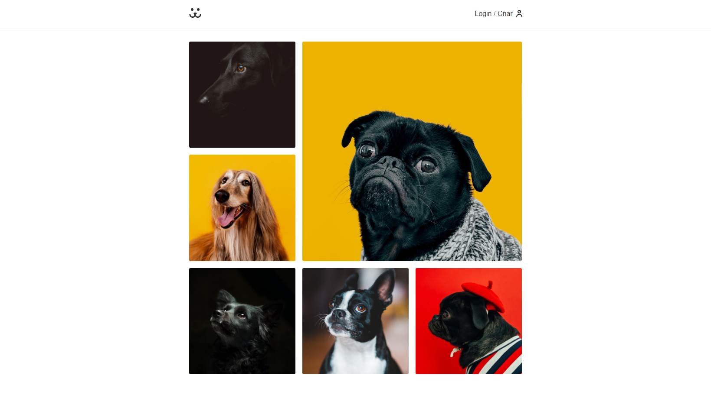

## 💻 Projeto

Dogs é uma rede social voltada para cachorros.

Esse projeto foi desenvolvido durante o curso de React Completo da Origamid.

Foi utilizado uma REST API desenvolvida em WordPress utilizando JWT para autenticação.

## 🧭 Tecnologias

O projeto foi desenvolvido com as teconlogias:

- [ReactJS](https://reactjs.org/)
- [SASS](https://sass-lang.com)
- [Victory](https://formidable.com/open-source/victory/)
- [Features do JavaScript ES6+](https://www.javascript.com/)

<h2>
  📌 Executando o projeto
</h2>

### Clone the repository to have a copy of the code on your machine

```bash
$ git clone https://github.com/thiagotnon/Dogs.git && cd Dogs
```

### Instale as dependências

```bash
$ yarn install
```

### Execute o backend

```bash
$ yarn server
```

### Execute o projeto

```bash
$ yarn dev
```

O aplicativo será executado no endereço **http://localhost:3000**

<h4 align=center>Feito com ❤️ por <a href="https://www.linkedin.com/in/thiago-nascimento-2540a0a3/">Thiago N.</a></h4>
